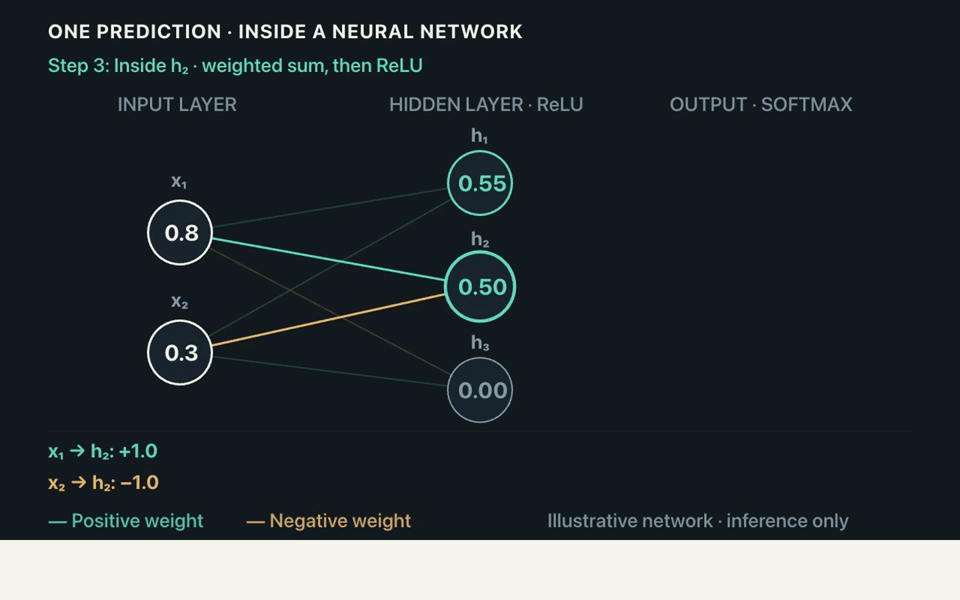

# Unfold

[Website](https://robotdad.github.io/amplifier-smart-tool-unfold/)

**Make an idea clear through motion.**



Unfold helps you and your agent turn technical explanations into animations.
Describe a concept, a flow through your system, or the handoff you want people to
understand. Review the result, compare revisions side by side, and give feedback
on the moment that needs work.

Use animated geometry, lines, images and text to explain a complicated interaction,
or add graphics to a recorded demo. Keep your team's visual guidance and reusable
assets in identity packs, then share those packs as ZIPs so others can use the same
visual language.

## Quick start: bring an idea to your agent

Give your coding agent this message, replacing the example with your own idea:

> Use [Unfold](https://github.com/robotdad/amplifier-smart-tool-unfold) to animate
> how a request moves from a caller to an agent, through tools, and back as an
> artifact. Read its [usage skill](src/unfold/SMART_TOOL.md) for installation,
> then `unfold --help` and the relevant command's `--help`. Help me configure
> model access, create the animation, and open the dashboard so I can review it.
> Use geometry and movement to explain the handoffs, with minimal text.

Your agent installs and runs Unfold, supplies the explanation and creates the
project. You can work entirely through conversation or use the dashboard to watch,
compare and refine. No repository checkout is needed to use the tool; this private
repository currently requires GitHub access.

### Before your first animation

Use a coding agent that can run local tools and open a browser. Unfold requires
Python 3.12+, Git, uv, Node.js, and FFmpeg with FFprobe. Your agent can follow the
usage skill to install the pinned renderer dependencies. Unfold runs on macOS,
Linux, and Windows.

Creative work uses **Amplifier Agent** and needs its own configured model access.
Your coding agent's access is not automatically shared with Unfold. Ask your agent
to configure OpenAI, Anthropic or Gemini with a vision-capable model. Unfold uses
API keys from its process environment; the dashboard does not provide sign-in or
credential settings. Model calls may incur your provider's charges.

Your agent supplies permission and limits for each creative request, including
which explanation, feedback and sampled frames may be sent to the model. Managing
saved work, sharing packs and rendering existing compositions run without a model.

### For the agent receiving this link

```sh
uv tool install "amplifier-smart-tool-unfold[smart] @ git+https://github.com/robotdad/amplifier-smart-tool-unfold"
unfold --help
```

The top-level help is the tool-owned usage skill, including renderer setup and
provider configuration. Read `unfold COMMAND --help` or
`unfold call CAPABILITY --help` for each capability's arguments, examples, results
and recovery guidance. `-h` gives a short argument reference.

## Review alongside an MCP conversation

The optional `[mcp]` extra exposes typed standard MCP tools and a portable MCP Apps
review view. Users and agents share retained revisions, feedback drafts, playback
position and owned creation/refinement jobs. The view needs no localhost viewer
URL or end-user Node installation. Start with `unfold-mcp --library /chosen/library`;
model-backed work additionally requires `[smart,mcp]`, `--allow-models`, a prepared
renderer and explicit bounded grants. See [MCP setup, coverage and limits](docs/MCP.md).

## What the loop looks like

1. **Explain.** Tell your agent what the audience knows and what the animation
   should make clear. Supply the actual system relationships or reference footage.
2. **Review.** Watch a revision on its own or play two side by side with synchronized
   timing. Earlier revisions remain available.
3. **Refine.** Leave feedback on a moment or interval. Drafts are retained. When
   your agent has authorized a refinement allowance, **Apply** sends it directly
   to Unfold's embedded agent. You do not need to relay it through the caller.
   New results appear for you to select; they do not replace the revision you are viewing.
4. **Reuse.** Browse packs and preview assets. Create a variation, rename items,
   or adopt another identity version deliberately. Share reusable packs by ZIP.
5. **Deliver.** Save a finished video or a transparent overlay for another
   compositor. Delivery packages preserve separate supplied audio and timing.

The theme icon cycles System, Light and Dark; System is the default. Closing the
browser does not stop the dashboard service or a running refinement. Use the
cancellation control for a job, or ask your agent to stop the service when finished.

Your library stays on your machine. Imported files can be copied into it or retained
as references to their original locations. Neither option moves or deletes the
original. Existing projects retain the identity version they used, so changing a
pack does not silently change earlier work.

## What to expect

The 20-second demo above combines a neural-network explanation with the real
Unfold dashboard playing **From spark to system**. Both animations were made
through Unfold. The captions describe the workflow with your agent: describe
the idea, review the result, and refine it together.

Unfold makes compositions from one frame (1/30 second) through 60 seconds at
native 1920×1080 (new-work default) or 1280×720 and 30 fps, including 2- and
2.5-second identity bumpers. Set `output: {"resolution":"720p"}` in the brief
to choose 720p. Existing saved work and deterministic re-renders keep their
original resolution; export does not upscale old compositions. Durations round
to the nearest complete frame, with half-frame ties rounding up. It supports
animated geometry, text, images, stroke drawing and camera movement. This is an
early implementation, not a full video timeline editor. Creative quality depends
on the model and brief; watch the animation before sharing it. Frame samples and
a model's review cannot establish that every transition or explanation is correct.

Video export produces H.264 MP4. Overlay export produces silent ProRes 4444 MOV
with transparency, for a compositor that supports it; browser playback is not
assumed. Reference footage fits the canvas with letterboxing. Unfold does not
track objects in footage or perform region/crop transforms.

You can import, trim, place and mix audio. Unfold does not generate or transcribe
sound, and the model does not listen to it. Recording audio is excluded unless
provided separately as an audio asset. Pack ZIPs share reusable identities and
eligible assets; they are not editable-project backups.

Custom brand typography stays editable: import static TTF/OTF faces as font assets,
assign display/heading/body roles in an identity, and use them in text or cards.
Retained scenes bundle the required faces, while identity ZIPs and delivery handoffs
preserve redistribution declarations and report fonts they cannot include. See
`unfold import-asset --help` and `unfold save-pack --help` for the supported inputs.

## Developing or contributing?

[`AGENTS.md`](AGENTS.md) covers checkout setup, architecture, verification and
contribution rules. The [vision](docs/VISION.md) and [contracts](contracts/README.md)
remain drafts; the [usage skill](src/unfold/SMART_TOOL.md) describes implemented
capabilities and their limits.
